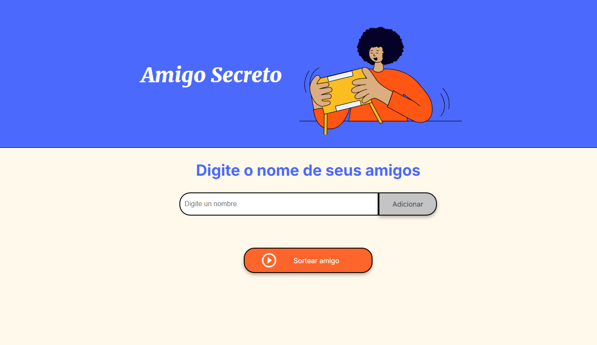
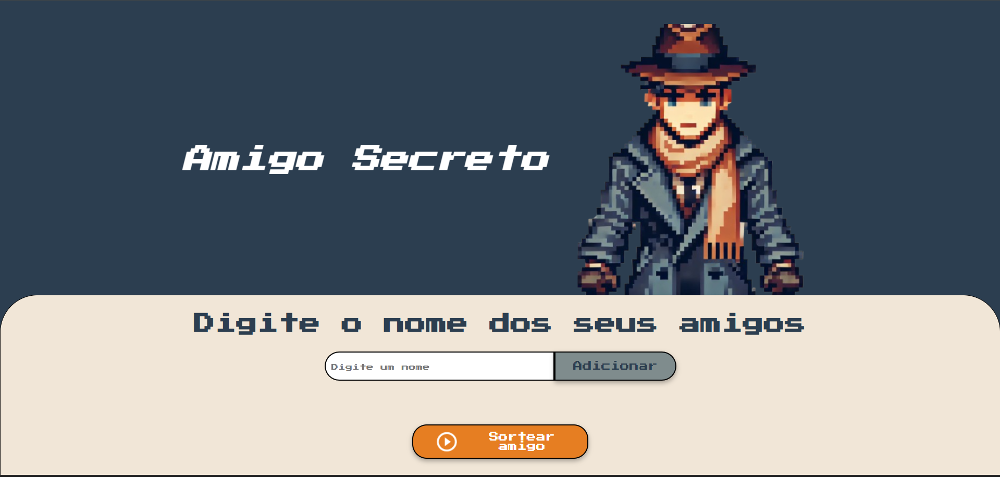

# Challenge - ONE - Turma 7: Codificador de Texto

  

## Objetivo

Neste desafio, o objetivo foi criar uma aplicação para realizar o sorteio de um "Amigo Secreto". A aplicação permite que os usuários insiram nomes de amigos, visualize a lista e, ao final, realize um sorteio aleatório para determinar o amigo secreto.

## Ferramentas utilizadas

  

## Como Usar

1. Abra a aplicação em um navegador.
2. Insira o nome de um amigo no campo de entrada e clique em "Adicionar" para adicioná-lo à lista.
3. Para realizar o sorteio, clique no botão "Sortear Amigo". O nome do "Amigo Secreto" será exibido na tela.

Você também pode testá-lo por aqui:

[Link para o MiniProjeto](https://yannleao.github.io/Amigo-secreto/)

    

> Ideia inicial do projeto

    

> Minha implementação
